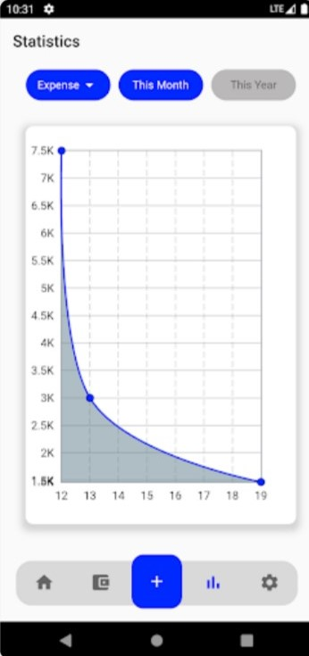

 # Money Matter

Money Matter is a money management application which is
used to manage personal finance.User can add their income
and expense to money matter.Money Matter shows graphs by
analysing your transactions.

## Table of contenst

- [Installation](#installation)
- [Usage](#usage)
- [Screenshots](#screenshots)
- [Packages and Credits](#packages-and-credits)
- [Google Play Store](#google-play-store)
- [License](#license)

## Installation

To install and run this project, you will need to have the following dependencies installed on
your machine:
 - Flutter SDK
 - Android Studio or Visual Studio Code

To install the project, follow these steps:

1. Clone the repository to your local machine
2. Open the project in Android Studio or Visual Studio Code
3. Connect an Android device or lauch an emulator
4. Run the command 'flutter pub get' using the terminal
5. Run the project by clicking the "run" button in the top menu or by using the terminal
   command 'flutter run'

## Usage 

User can do  the following:

- Add transactions 
- Edit transaction
- Update transaction
- Delete transaction
- Can see the total balance,total income and total expenses.
- Can filter your transactions according to the timeperiod and category.
- Reset the app data in setting, so the entire app data will be cleared.
- Analyse the transactions by using the charts.

## Screenshots 

Home Screen                    |   All transaction Screen             |  Statistics Screen 
:-------------------------:|:-------------------------:|:-------------------------:|
|||

## Packages and Credits

- [Fl chart](https://github.com/imaNNeoFighT/fl_chart))
- [Google fonts](https://github.com/material-foundation/google-fonts-flutter)
- [Hive flutter](https://github.com/hivedb/hive/tree/master/hive_flutter)
- [Shared preferences](https://github.com/flutter/plugins/tree/main/packages/shared_preferences/shared_preferences)
- [Time zone](https://github.com/srawlins/timezone)
- [Url launcher](https://github.com/flutter/plugins/tree/main/packages/url_launcher/url_launcher)
- [Flutter laucher icons](https://github.com/fluttercommunity/flutter_launcher_icons/)

## Google Play Store

The project is available for download on the Google Play Store [here](https://play.google.com/store/apps/details?id=com.aswinofficial3.mtracker).

## License

- MIT License
- Copyright 2022 © [Vivek V.G](https://github.com/Vivekvg01)